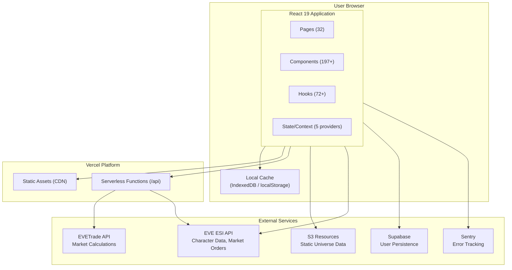
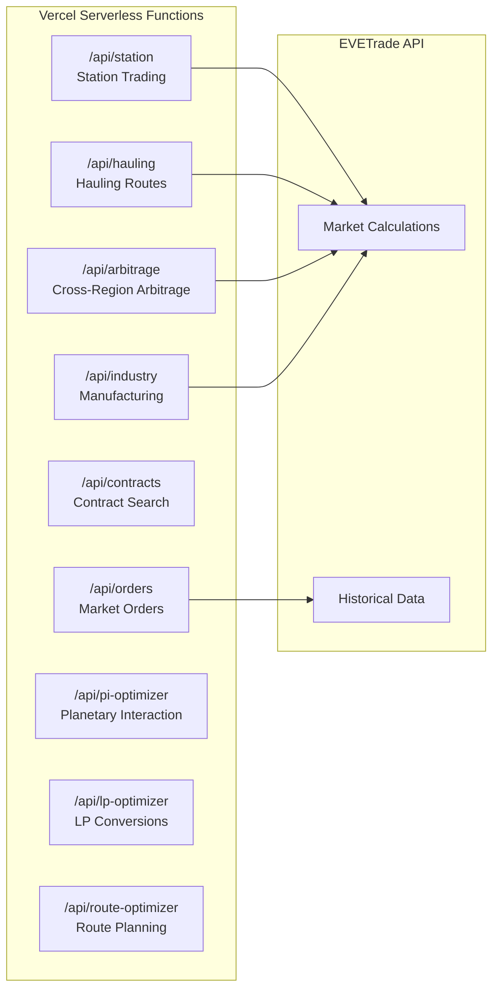
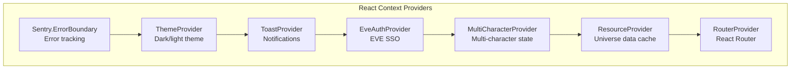
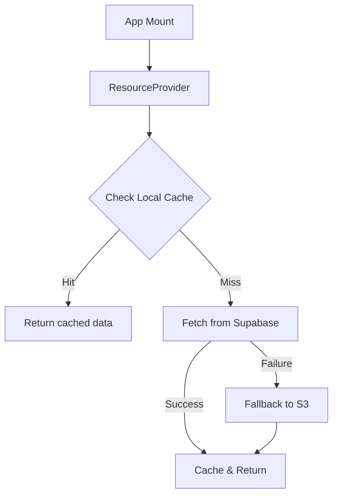
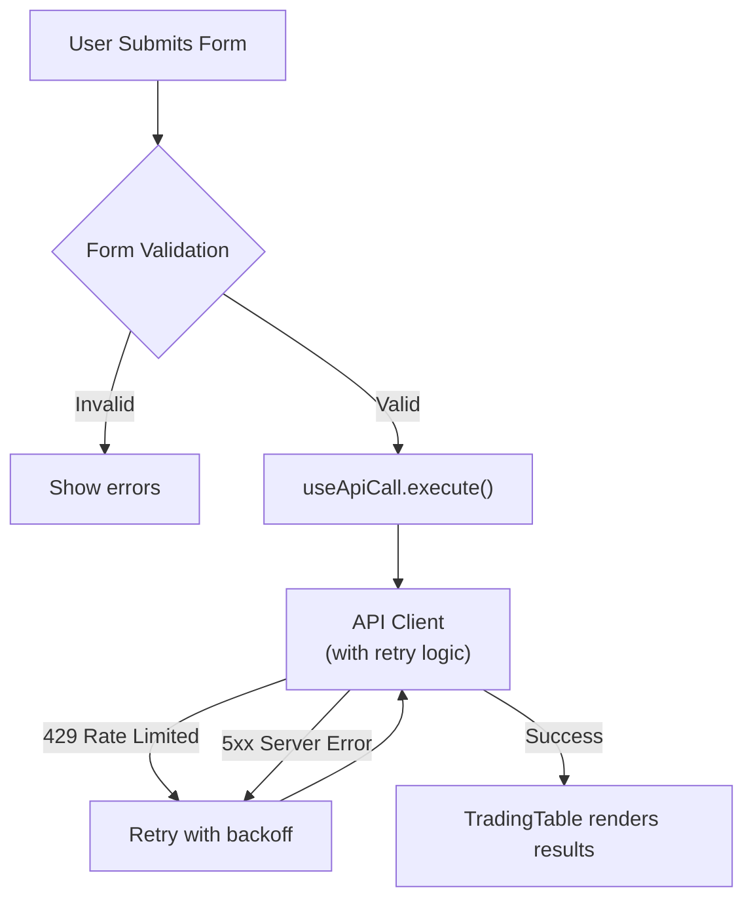
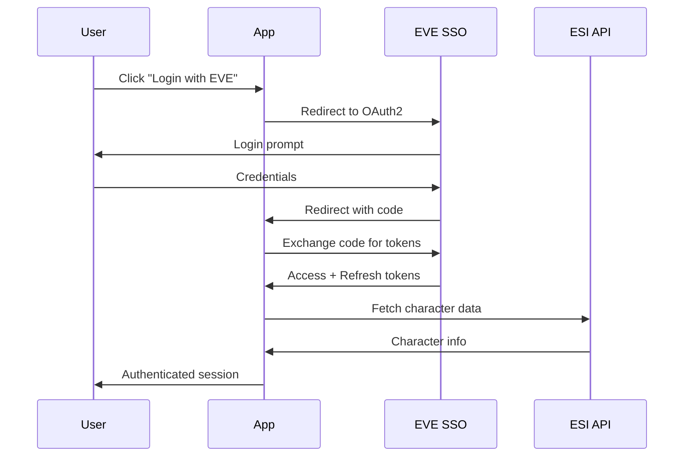
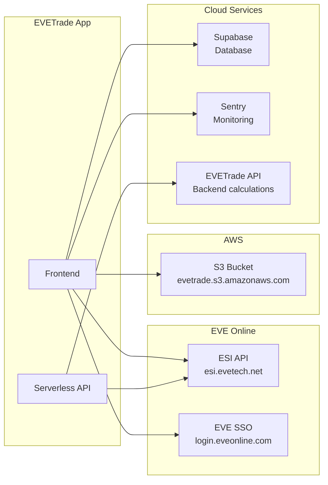
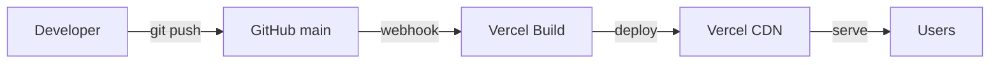

# Architecture Overview

This document describes the architecture of EVETrade Modern - a comprehensive EVE Online trading application built with React 19.

## High-Level Architecture



## Serverless API Endpoints



## Core Technologies

| Technology | Version | Purpose |
|------------|---------|---------|
| React | 19.2.0 | UI framework with concurrent features |
| Vite | 7.2.4 | Build tool & dev server with HMR |
| React Router | 7.9.6 | Client-side routing with lazy loading |
| Tailwind CSS | 4.1.17 | Utility-first styling |
| Axios | 1.13.2 | HTTP client with retry logic |
| Supabase | 2.86.0 | Data persistence & auth fallback |
| Sentry | 10.27.0 | Error tracking & monitoring |
| HeadlessUI | 2.2.9 | Accessible UI components |

## Provider Hierarchy



## Data Flow

### Resource Loading



### Trading Query Flow



## Directory Structure

```
evetrade/
├── src/
│   ├── api/                    # API layer (14 files)
│   │   ├── client.js           # Axios client with retry logic
│   │   ├── esi.js              # EVE ESI API integration
│   │   ├── trading.js          # Trading API endpoints
│   │   └── ...
│   │
│   ├── components/             # React components (197+ files)
│   │   ├── analytics/          # Market analysis (8 components)
│   │   ├── common/             # Shared UI (165+ components)
│   │   ├── dashboard/          # Dashboard widgets (8 components)
│   │   ├── forms/              # Form components (7 components)
│   │   ├── inventory/          # Inventory management (8 components)
│   │   ├── layout/             # Page layouts (3 components)
│   │   ├── routing/            # Route optimization (7 components)
│   │   ├── tables/             # Data tables (2 components)
│   │   └── trading/            # Trading features (25+ components)
│   │
│   ├── hooks/                  # Custom React hooks (72+ files)
│   ├── lib/                    # Third-party integrations
│   ├── pages/                  # Page components (32 files)
│   ├── store/                  # Global state
│   └── utils/                  # Utility functions (12 files)
│
├── api/                        # Vercel serverless functions
│   ├── station.js
│   ├── hauling.js
│   ├── orders.js
│   ├── arbitrage.js
│   ├── contracts.js
│   ├── industry.js
│   ├── route-optimizer.js
│   ├── pi-optimizer.js
│   └── lp-optimizer.js
│
└── docs/                       # Documentation
```

## Authentication Flow



## Route Configuration

| Route | Page Component | Description |
|-------|----------------|-------------|
| `/` | HomePage | Landing with feature selection |
| `/station-trading` | StationTradingPage | Single station margin trading |
| `/station-hauling` | StationHaulingPage | Station-to-station hauling |
| `/region-hauling` | RegionHaulingPage | Region-to-region trading |
| `/arbitrage` | ArbitragePage | Cross-region arbitrage |
| `/market-velocity` | MarketVelocityPage | Market velocity analysis |
| `/pi-optimizer` | PIOptimizerPage | Planetary interaction |
| `/industry-profits` | IndustryProfitsPage | Manufacturing analysis |
| `/lp-optimizer` | LPOptimizerPage | LP conversion |
| `/contracts` | ContractFinderPage | Contract search |
| `/corp-orders` | CorpOrdersPage | Corporation orders |
| `/smart-route` | SmartRouteOptimizerPage | Route optimization |
| `/dashboard` | TradingDashboardPage | Trading dashboard |
| `/watchlist` | WatchlistPage | Watchlist management |
| `/portfolio` | PortfolioPage | Portfolio management |
| `/alerts` | AlertsPage | Alert management |

## External Services Integration



## Key Design Decisions

### 1. Hybrid Caching Strategy
Resources are cached locally using both IndexedDB (large objects) and localStorage (small objects):
- Fast subsequent loads
- Offline capability for cached data
- Automatic 1-hour cache expiration

### 2. Code Splitting
Large dependencies split into separate chunks:
- `vendor-react`: React, ReactDOM, React Router
- `vendor-ui`: HeadlessUI
- `vendor-markdown`: react-markdown, remark-gfm

### 3. Progressive Enhancement
The app works with:
- S3 only (default, no configuration needed)
- Supabase + S3 fallback (when configured)
- Local cache even when offline

### 4. Theme System
Uses CSS custom properties (via Tailwind) with a context provider:
- Dark theme (default): Space-themed with cyan accents
- Light theme: Clean white with dark text
- Theme preference persisted in localStorage

## Build & Deployment



### Commands

```bash
npm install      # Install dependencies
npm run dev      # Start Vite dev server with HMR
npm run build    # Build for production
npm run test     # Run Vitest tests
npm run lint     # Run ESLint
```

## Security Considerations

1. **No secrets in frontend** - All sensitive data handled by backend
2. **EVE SSO** - OAuth2 flow for authentication
3. **CORS** - Configured on backend services
4. **Input validation** - Client-side and server-side validation
5. **Error sanitization** - Sentry captures without PII
